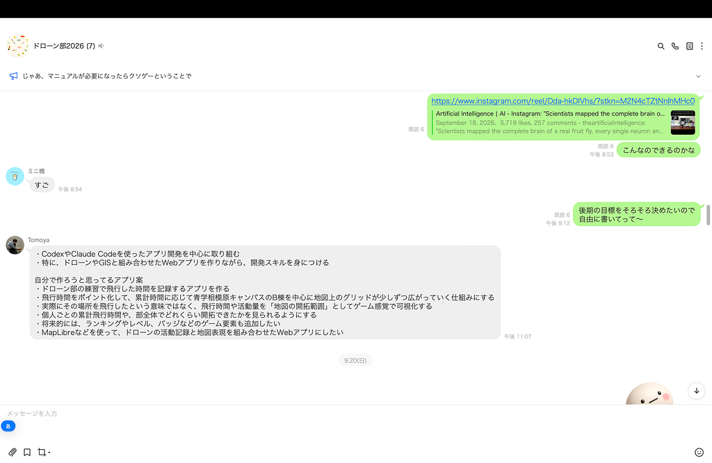
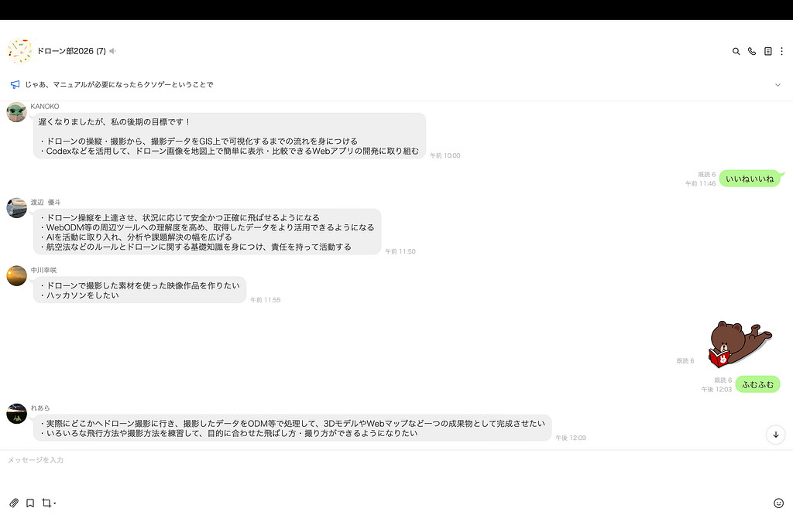
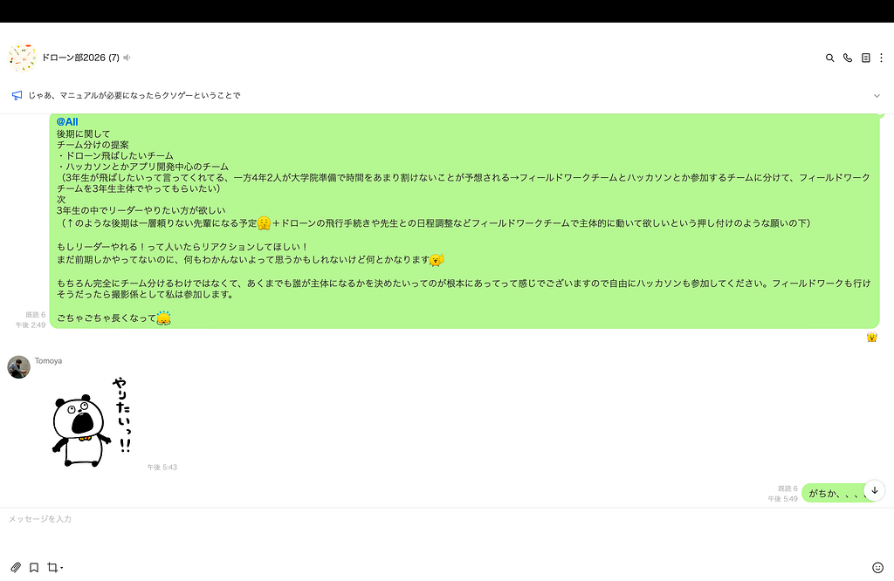
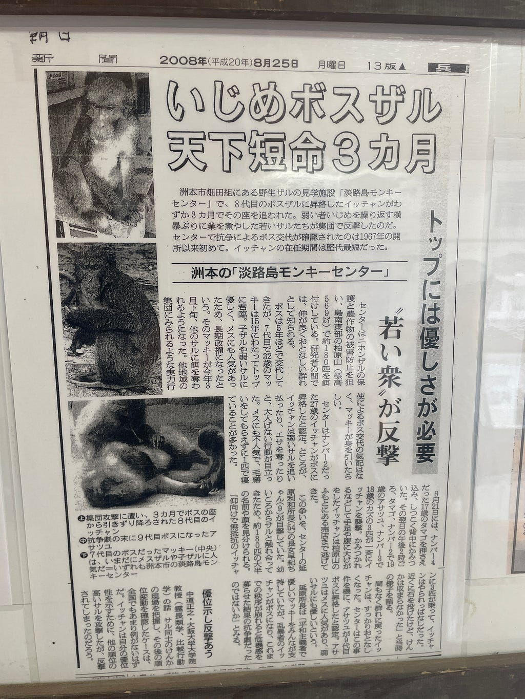
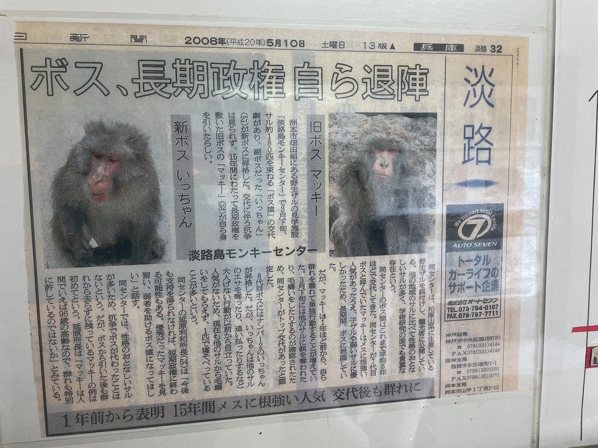
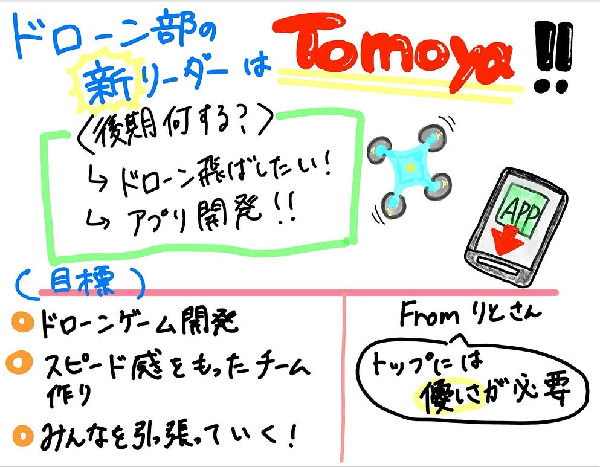

### マッキーかイッチャンかドローン部の行方はいかに

こんにちは！ドローン部１の山﨑です！  
今回はドローン部新リーダー誕生について話していけたらと思います。  
ドローン部が後期やることに関しては2が話します！！

#### 悩みに悩んだ夏休み後半

夏休みが終わるなぁ、嫌だなー、学校始まるなぁ、嫌だなぁ、そういえば学生最後の夏休みだったのか、、、なんて思いにふけっていたFOSS4Gが終わったころ  
後期ドローン部なにやりたいかって何も決まってないし、話し合ってすらなかった😵

夏休み中は[ハッカソン](https://asciistartup.connpass.com/event/399798/)に参加してみましたので作品はお時間ある時にでも

作品のリンクは[**こちら**](https://github.com/furuhashilab/plateau-cityhack-2026-hokudai-son)

話は戻って

前期の反省も活かして、ドローン部はみんなの意見を聞きましょうって考えました

ってことで後期何をしたい？って聞いてみました  
こんな感じに↓

いい先輩って自己陶酔しつつみんなが何をしたいかをてみてみると

どうやらドローンを飛ばしたいようだ

それは当然、なぜならドローンを買って飛ばしたのまだ1回だけ

もっと飛ばしたい！！って言ってくれて嬉しい

一方でハッカソンとかに参加したいとの声が山﨑やアキさんから聞こえてくる  
（それぞれの進路に向けて準備が忙しくはなりつつも、後輩に向けて何かを残せたらいいという優しい心持ちで苦渋のアプリ開発を提案）

これはチームをドローンチームとアプリ開発チームで分けないとだ！

アプリ開発チームの方は山﨑が担当できる

ドローンチームはアキさんには頼めない、、、と独断で判断をし

後期は4年生の集大成ではなく、3年生が来年もゼミを引っ張っていくための準備期間であると解釈をし  
リーダーは3年生の中で決めることに

そもそもルール的にアウトだったらどうしようと思い[古橋研究室GitHub](https://github.com/furuhashilab)をチェックしても問題なさそう！！

送った内容が↓

と、だいぶひどいメッセージに多くのドローン部が引いている中、、

反応してくれたトモヤ！！！  
ってことで

#### 後期ドローン部総リーダー 智也（漢字確認ずみ）誕生！！

💪(⌒▽⌒)🖐️  
:::: 🦵 🦵:::::

ハッカソンに急に参加するって時もそうでしたが、いつも智也くんの積極性には助かっております

ありがとう！そしておめでとう！

#### 智也の意気込み全文

「前期は自分もまだ入りたてで難しい部分はありました。  
けど夏休みのハッカソンであったり、自分なりにも色々勉強して成長をしたと思います。後期は前期と異なり、積極的にチームを引っ張って来年の研究室でもリーダー的存在になりたいです。後期はドローンのゲーム開発をするつもりです。  
後期と限られた期間で完成させるためには、チームとの話し合いはしつつも、スピード感を意識したチーム作りができたらなと考えています。」

#### まとめ

いかがだったでしょうか、、、、  
こんなのが週報でいいのかと思っている方も多いと思います  
でも許していただきたい  
ドローン部のアプリ開発に関して話したかったのですが  
智也さんが率いるドローン部２が全部話すからと指示が降りたので  
話す内容を絞り出したのです😭

追記：  
智也がリーダーになってから、前リーダーに対する当たりが強くなったなと感じています  
ここで１つ私が前期のリーダーをやるにあたって  
道標としていた新聞をご覧ください

トップには優しさが必要

### イッチャンではなくマッキーであれ

この言葉を前期ドローン部の締めの言葉とさせていただきたいと思います。

ありがとうございました🫡

---

[マッキーかイッチャンかドローン部の行方はいかに、、](https://medium.com/furuhashilab/%E3%83%89%E3%83%AD%E3%83%BC%E3%83%B3%E9%83%A8%E5%BE%8C%E6%9C%9F%E3%83%AA%E3%83%BC%E3%83%80%E3%83%BC%E3%81%AF-fd9fdc7fbedb) was originally published in [Furuhashi(mapconcierge)Lab.](https://medium.com/furuhashilab) on Medium, where people are continuing the conversation by highlighting and responding to this story.
